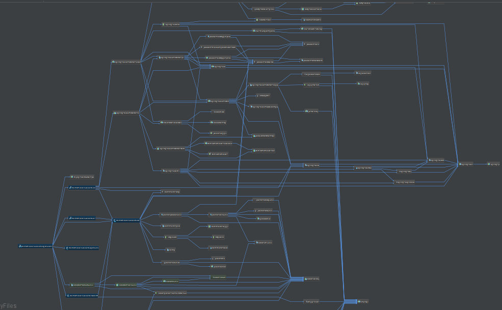

* content
{:toc}

## 依赖冲突频繁且正常    

大型集成框架中,出现不同框架的依赖冲突是非常正常.  
比如Spark与SpringBoot框架,就会有诸如Netty,Jackson,log4j等等冲突,甚至在某些情况下包括scala-lang都会有冲突点  
这里简述下对于这种依赖冲突的处理以及避免  

## 框架设计的优解  

dependencyManagement是一种版本管理规约,在dependencyManagement中设定的依赖,不会直接体现任何模块中.  
模块可以直接引用规约中的版本而无需设定版本,而在具体的版本中,会依赖使用就近原则,如果使用方设定了版本,就会使用设定版本,否则会使用规约版本.注意这种规约是可以向上追溯的,也就是框架提供方和框架使用方可以同时设置自己的规约  

有一个比较类似的是设定版本version为 provided 或 compile,这也是将版本交由使用方设定,这两者的区别是compile会在编译时使用版本,并且Jar会作为编译的一部分到classpath中,provided是在外部环境中使用版本,其不会作为编译部分.比如某个jar使用compile,则必须在模块中设定版本并引用,这个jar会到classpath中,而如果使用provided,则在框架部分会彻底忽略这个jar,必须在上线是或自己加入classpath中


既然是依赖冲突,那么其最终和最优解一定是在框架设计的本身上  
在OO思想中的理想情况是提供接口而不是指向具体实现来获得最大的灵活性(依赖倒转),对于框架依赖设计也是一样,理想情况是框架本身只需要声明其需要的依赖,而交由其引用这个框架的使用方选择具体的依赖版本,此时可以设置Version为compile或provided,但如果完全如此,使用方如果使用了多个或比较复杂的框架集成,需要手动设置的依赖之多,可能会导致使用方直接放弃使用该框架.这不是我们解决问题的初衷.  
所以,最好的情况是,框架提供方声明其需要的依赖,但同时给出其默认版本.使用户可以在无需手动设置依赖而可以直接使用,但同时又允许用户对依赖做出干预,即用户可以选择使用自己设置的版本.  
综上,个人理解框架提供方最好的解决之道,是dependencyManagement而不是version.compile  

1. 在项目中设定dependencyManagement  

```xml
<dependencyManagement>
	....
	<dependency>
		<groupId>org.scala-lang</groupId>
		<artifactId>scala-library</artifactId>
		<version>${scala.version}</version>
	</dependency>
	<dependency>
		<groupId>org.scala-lang.modules</groupId>
		<artifactId>scala-xml_2.11</artifactId>
		<version>${scala.version}</version>
	</dependency>
	...
</dependencyManagement>
```

2. 在模块中引用dependencyManagement,但不设置版本  

```xml
<dependency>
	...
	<groupId>org.apache.kafka</groupId>
	<artifactId>kafka_2.11</artifactId>
	...
</dependency>
```

3. 使用方使用微调  
使用方微调可以使用自己的依赖规约或设置忽略版本都可以.  

*1.设定自己的依赖规约*  
```xml
<dependencyManagement>
	....
	<dependency>
		<groupId>org.scala-lang</groupId>
		<artifactId>scala-library</artifactId>
		<version>${scala.version}</version>
	</dependency>
	...
</dependencyManagement>

*2.设置忽略版本*  
设置忽略版本,有时也是比较需要的.比如某些框架的依赖的依赖,没有设定依赖规约而是一种强版本引用(吐槽一下这都没做好的框架,还是知名框架呢),这时就必须设置忽略版本

​```xml
<dependency>
	<groupId>org.springframework.boot</groupId>
	<artifactId>spring-boot-starter-thymeleaf</artifactId>
	<version>${spring-boot.version}</version>
	<exclusions>
		<exclusion>
			<artifactId>thymeleaf</artifactId>
			<groupId>org.thymeleaf</groupId>
		</exclusion>
	</exclusions>
</dependency>
```
##  依赖的验证  

可以使用Idea的插件Maven dependency manager,提供可视化的依赖图,这个插件做的非常好的是自带冲突检测(检测标准为对同一个GA如果出现了不止一次,就把这个GA全部标红),所以主需要关注下红色处理下就OK了,理想情况如下:



 